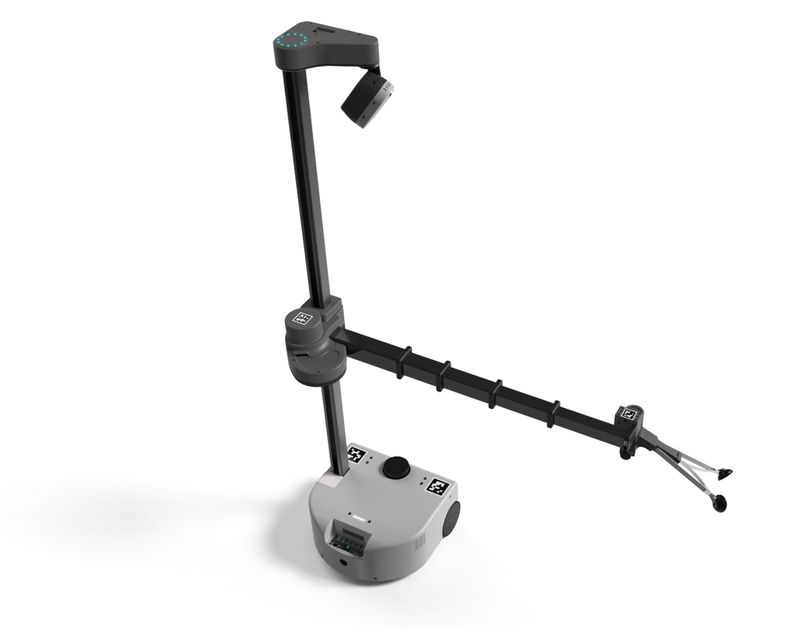

# Overview

The [Stretch Hardware Guides](https://github.com/hello-robot/stretch_hardware_gides) repository maintains documentation on the use and specifications of the Stretch mobile manipulators hardware.

=== "Stretch RE2"
    
    | Model | Guide                                                        | Description                                                  |
    |-----| ------------------------------------------------------------ | ------------------------------------------------------------ |
    | RE2| [Safety Guide ](https://docs.hello-robot.com/0.2/stretch-tutorials/getting_started/safety_guide/)                     | Safety guide for users of the Stretch                        |
    | RE2| [Battery Maintenance Guide](./docs/battery_maintenance_guide_re2.md) | Guide to care for and charge the Stretch RE2 Batteries       |
    | RE2| [Hardware Guide](./docs/hardware_guide_re2.md)          | Specification and functional description of the Stretch RE2 Hardware |
    | RE2| [Dex Wrist Guide](./docs/dex_wrist_guide_re2.md)        | Installing, configuring, and working with the Stretch RE2 Dex Wrist |

=== "Stretch RE1"
    
    | Model | Guide                                                        | Description                                                  |
    |-----| ------------------------------------------------------------ | ------------------------------------------------------------ |
    | RE1| [Safety Guide ](https://docs.hello-robot.com/0.2/stretch-tutorials/getting_started/safety_guide/)                     | Safety guide for users of the Stretch                        |
    | RE1| [Battery Maintenance Guide](./docs/battery_maintenance_guide_re1.md) | Guide to care for and charge the Stretch RE1 Batteries       |
    | RE1| [Hardware Guide](./docs/hardware_guide_re1.md)          | Specification and functional description of the Stretch RE1 Hardware |
    | RE1| [Dex Wrist Guide](./docs/dex_wrist_guide_re1.md)        | Installing, configuring, and working with the Stretch RE1 Dex Wrist |

## License

For details, see the [LICENSE.md](https://github.com/hello-robot/stretch_hardware_guides/blob/master/LICENSE.md) file in the root directory.

------

 All materials are Copyright 2022-2024 by Hello Robot Inc. Hello Robot and Stretch are registered trademarks.

