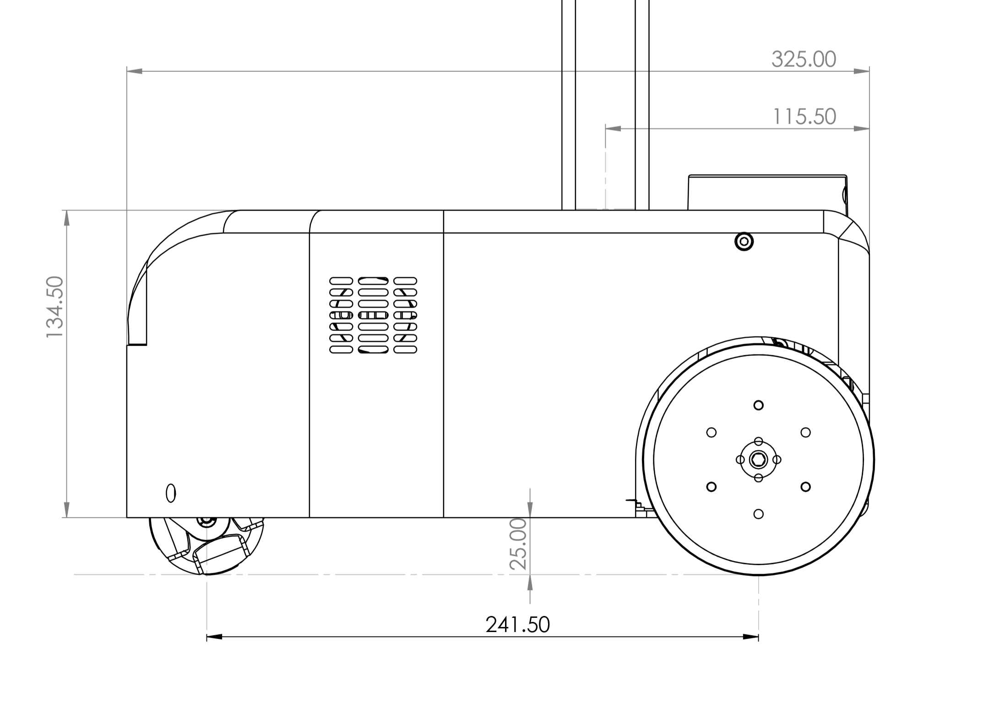
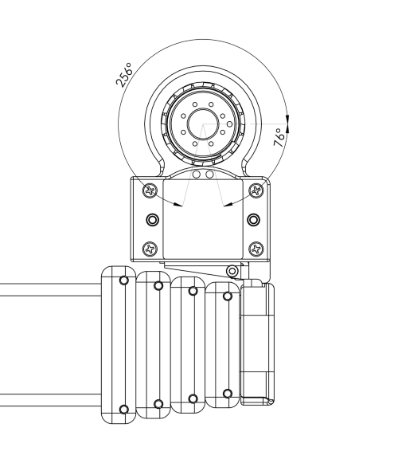
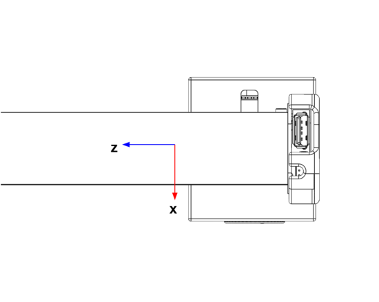
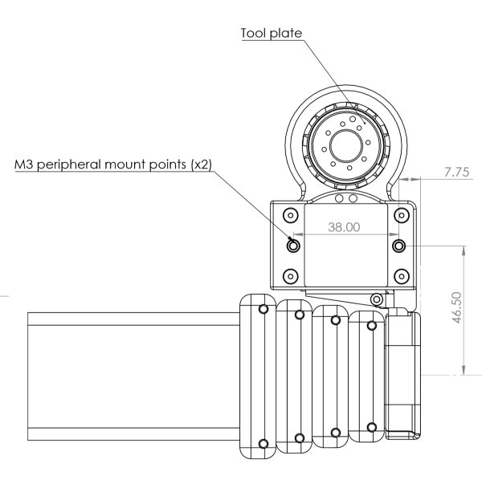

# Stretch 3 Hardware Guide

This manual provides the engineering data and user guidance for working with the Hello Robot Stretch 3 hardware.  

### Disclaimer

<u>The Hello Robot Stretch is intended for use in the research of mobile manipulation applications by users experienced in the use and programming of research robots. This product is not intended for general use in the home by consumers, and lacks the required certifications for such use. Please see the section on Regulatory Compliance for further details.</u>

## Functional Specification

Subsystem data sheets [available here](https://drive.google.com/file/d/1MTPGHyhpi701qVWxADoLGSCM2ueuESSh/view).

## Body Plan

## Hardware Architecture

## Robot Subsystems

### Base

The base is a two wheel differential drive with a passive omniwheel for a caster.  It includes four cliff sensors to allow detection of stairs, thresholds, etc.

<table>
  <tr>
    <td></td>
    <td>Item</td>
    <td>Notes</td>
  </tr>
  <tr>
    <td>A</td>
    <td>Drive wheels</td>
    <td>4 inch diameter, urethane rubber shore 60A</td>
  </tr>
  <tr>
    <td>B</td>
    <td>Cliff sensors</td>
    <td>Sharp GP2Y0A51SK0F, Analog, range 2-15 cm</td>
  </tr>
  <tr>
    <td>C</td>
    <td>Omni wheel</td>
    <td>Diameter 50mm</td>
  </tr>
</table>

The base has 6 M4 threaded inserts available for mounting user accessories such as a tray. The mounting pattern is shown below.

The inserts are recessed 1mm from the top of the base shell. Maximum safe fastener depth is 7mm below top of shell.

#### Base IMU

The base has an IMU using the 9 DOF BNO085 chipset. The IMU orientation is as shown below:

### Trunk

Development and charge ports are at the back of the base in the trunk. 

<table>
  <tr>
    <td></td>
    <td>Item</td>
    <td>Notes</td>
  </tr>
  <tr>
    <td>A</td>
    <td>Vent</td>
    <td>Intake vent for computer fan</td>
  </tr>
  <tr>
    <td>B</td>
    <td>4 Port USB Hub</td>
    <td>USB 3.0 , powered 5V</td>
  </tr>
  <tr>
    <td>C</td>
    <td>Ethernet</td>
    <td>Connected to computer NIC</td>
  </tr>
  <tr>
    <td>D</td>
    <td>On/Off</td>
    <td>Robot power on / off. Switch is illuminated when on.</td>
  </tr>
  <tr>
    <td>E</td>
    <td>Charge</td>
    <td>Rated for applied 12V/7A charger</td>
  </tr>
  <tr>
    <td>F</td>
    <td>HDMI</td>
    <td>Connected to computer HDMI</td>
  </tr>
  <tr>
    <td>G</td>
    <td>LED Light Bar</td>
    <td>Indicates battery voltage</td>
  </tr>
   <tr>
    <td>H</td>
    <td>12V access plug</td>
    <td>Allows customer cable access to 12V Aux on Pimu PCBA</td>
  </tr>
</table>

#### 12V Access Plug

The 12V access plug allows users to supply 12V power to an external device. This 12V power is directly connected to the battery and is not a regulated voltage supply. As the battery voltage decreases, the 12V access plug voltage also decreases. It is recommended that the user purchase a regulated voltage adapter to connect to this access plug and then connect the external device to the regulated voltage adapter, instead of connecting directly to the 12V access plug. The maximum continuous current of the 12V access plug is 6A max.

!!! warning

    If the cable on the 12V access plug is wired incorrectly, the main power board of the robot will get damaged

### Head

The head provides the audio interface to the robot, a pan tilt depth camera and RGB wide-angle camera, a runstop, and a developer interface to allow for additional user hardware.

<table>
  <tr>
    <td></td>
    <td>Item</td>
    <td>Notes</td>
  </tr>
  <tr>
    <td>A</td>
    <td>Pan tilt camera module</td>
    <td>Intel RealSense D435if, Arducam B0385+LK001,
Dynamixel XL430-W250-T, Dynamixel XC430-W240-T</td>
  </tr>
  <tr>
    <td>B</td>
    <td>Speakers</td>
    <td></td>
  </tr>
  <tr>
    <td>C</td>
    <td>Runstop</td>
    <td></td>
  </tr>
  <tr>
    <td>D</td>
    <td>Developer Interface</td>
    <td>Volume control, USB2.0-A with 5V@500mA fused 
JST XHP-2,  12V@3A fused
Pin 1: 12V
Pin 2: GND</td>
  </tr>
  <tr>
    <td>E</td>
    <td>Microphone array</td>
    <td>ReSpeaker Mic Array v2.0, with programmable 12 RGB LED ring </td>
  </tr>
</table>

#### Pan Tilt

The head pan-tilt unit utilizes two Dynamixel servos, 1x XL430-W250-T and 1x XC430-W240-T. It incorporates a small fan in order to ensure proper cooling of the servo and camera during dynamic repeated motions of the tilt DOF.

The nominal ‘zero’ position is of the head is shown below, along with the corresponding range of motion.

<table>
  <tr>
    <td>DOF</td>
    <td>Range (deg)</td>
    <td>Min(deg)</td>
    <td>Max (deg)</td>
  </tr>
  <tr>
    <td>Pan</td>
    <td>346</td>
    <td>-234 </td>
    <td>112</td>
  </tr>
  <tr>
    <td>Tilt</td>
    <td>115</td>
    <td>-25</td>
    <td>90</td>
  </tr>
</table>

#### ReSpeaker Microphone Array
The ReSpeaker has 12 RGB LEDs that can be controlled programatically. By default they display sound intensity and direction of the microphone array. The ReSpeaker has 4 mems microphones mounted on a 64.61mm circle at 45 degree spacing. The drawing below shows the position and orientation of the microphone array relative to the head pan axis.

#### Mounting Points

The top of the head includes 3x M4 threaded mounting points as shown below.

#### Runstop

The runstop allows the user to pause the motion of the four primary DOF (base, lift, and arm) by tapping the illuminated button on the head. When the runstop is enabled, these DOF are in a ‘Safety Mode’ that inhibits the motion controller at the firmware level. Disabling the runstop allows normal operation to resume.

### Lift

The lift degree of freedom provides vertical translation of the arm. It is driven by a closed loop stepper motor, providing smooth and precise motion through a low gear-ratio belt drive. The ‘shoulder’ includes four mounting holes and a small delivery tray.

<table>
  <tr>
    <td></td>
    <td>Item</td>
    <td>Notes</td>
  </tr>
  <tr>
    <td>A</td>
    <td>Delivery tray</td>
    <td></td>
  </tr>
  <tr>
    <td>B</td>
    <td>Mounting holes</td>
    <td>Threaded M4. Length not to exceed 7mm.</td>
  </tr>
  <tr>
    <td>C</td>
    <td>Aruco Tag</td>
    <td>Size 40x40 mm</td>
  </tr>
      <tr>
    <td>D</td>
    <td>Developer ports</td>
    <td>USB2.0-A with 5V@500mA fused ; 
JST XHP-2,  12V@3A fused
Pin 1: 12V
Pin 2: GND</td>
  </tr>
</table>

!!! warning

    Maximum fastener length for shoulder mounting holes is 7mm - exceeding this depth may cause damage

    {: style="max-width:450px"}

Stretch 3 introduces a new lift brake feature. Upon power being disconnected to the lift motor (eg when the robot power switch is turned off), a brake will engage that prevents the arm and shoulder from falling rapidly. Instead, the robot arm will very slowly descend from its current position to the base of the robot. 

It takes approximately 2 minutes for the arm to fully descend from the top of the lift. After about 3 minutes, the brake function will disengage, and the lift will be backdrivable as normal. If it is necessary to backdrive the lift during the period where the brake is engaged, it can be overcome with a sufficient amount of external force. Hold the arm securely when backdriving it in this way.

### Arm

The arm comprises 5 telescoping aluminum links set on rollers. Its proprietary drive train is driven by a stepper motor with closed loop control and current sensing, allowing contact sensitivity during motion.

The arm exhibits a small amount of play (lash) in the X, Y, Z, and theta directions which is a normal characteristic of its design. Despite this it can achieve good repeatability, in part because its gravity loading is fairly constant.

The retracted arm and wrist combined are designed to fit within the footprint of the base. The arm is designed to have:

* Reach: 0.52m
* Recommended Max payload - 2kg

### Dexterous Wrist

The Stetch 3 dexterous wrist includes:

* Yaw, Pitch, and Roll DOFs
* 2 Aruco tags for calibration and visual localization of the tool
* Expansion port with
  * Arduino expansion header
  * USB-A connector
* Dynamixel X-Series TTL bus
* Integrated cabling for USB and 12V Power cables
* Quick-disconnect tool interface

<table>
  <tr>
    <td></td>
    <td>Item</td>
    <td>Notes</td>
  </tr>
  <tr>
    <td>A</td>
    <td>Wrist Yaw</td>
    <td></td>
  </tr>
  <tr>
    <td>B</td>
    <td>Wrist Pitch</td>
    <td></td>
  </tr>
  <tr>
    <td>C</td>
    <td>Wrist Roll</td>
    <td></td>
  </tr>
  <tr>
    <td>D</td>
    <td>Quick Disconnect</td>
    <td></td>
  </tr>
  <tr>
    <td>E</td>
    <td>Wrist USB and Expansion Header</td>
    <td></td>
  </tr>
</table>

#### Wrist Yaw

The wrist yaw is driven by a Dynamixel XC430-W240-T servo.

The wrist yaw shaft includes a 'Zero indicator'. This mark indicates the forward position of the tool. It will point in the direction of the arm extension when the wrist yaw joint is at its zero position.

The wrist yaw DOF is calibrated so that the index hole faces forward at the 'zero' position. From this pose the wrist has a Range of Motion of +256/-76 degrees as shown.

#### Wrist Pitch

The wrist pitch is driven by a Dynamixel XM540-W270-T servo.

The wrist pitch DOF is calibrated so that the tool is parallel to the ground at the 'zero' position. From this pose the wrist has a Range of Motion of +20/-90 degrees.

#### Wrist Roll

The wrist roll is driven by a Dynamixel XM430-W350-T servo.

The wrist roll DOF is calibrated such that the zero position is directly in the center of its range of motion. From this pose the wrist has a Range of Motion of +172.5/-172.5 degrees.

#### Wrist Accelerometer

The wrist includes a 3 axis [ADXL343](https://www.analog.com/media/en/technical-documentation/data-sheets/ADXL343.pdf) accelerometer which provides bump and tap detection capabilities. The sensor is mounted inside the distal link of the arm as shown below.

#### Wrist USB

The wrist includes a USB 2.0 A interface. This power to this USB port is fused to 500mA@5V. By default, this port is utilized by the Intel d405 gripper camera.

#### Wrist Expansion Header

The wrist includes an expansion header that provides access to pins of the wrist Arduino board.  The header connector can be accessed by removing the cap at the end of the arm.

The header is wired to a Atmel SAMD21G18A-AUT ([datasheet](http://ww1.microchip.com/downloads/en/DeviceDoc/SAM_D21_DA1_Family_DataSheet_DS40001882F.pdf)) microcontroller (same as Arduino Zero). The expansion header pins are configured at the factory to allow:

* General purpose digital I/O
* Analog input

In addition, the firmware can be configured for other pin functions, including:

* Serial SPI
* Serial I2C
* Serial UART

The [Stretch Firmware Manual](https://github.com/hello-robot/stretch_firmware) covers this modification.

**The header pins utilize 3V3 TTL logic. They have limited nterface protection (eg, ESD, over-voltage, shorts). It is possible to damage your robot if pin specifications are exceeded **

The pin mapping is:

<table>
  <tr>
    <td>Pin</td>
    <td>Name</td>
    <td>Function</td>
      <td>Factory Firmware</td>
  </tr>
  <tr>
    <td>1</td>
    <td>DGND</td>
    <td>Digital ground</td>
      <td></td>
  </tr>
  <tr>
    <td>2</td>
    <td>3V3</td>
    <td>3.3V supply fused at 250mA.</td>
      <td></td>
  </tr>
    <tr>
    <td>3</td>
    <td>E12V</td>
    <td>12VDC fused at 500mA</td>
        <td></td>
  </tr>
  <tr>
    <td>4</td>
    <td>SS</td>
    <td>DIO | SPI SS </td>
      <td>Digital out (D3)</td>
  </tr>
    <tr>
    <td>5</td>
    <td>SCK</td>
    <td>DIO | SPI SCK</td>
        <td>Digital out (D2)</td>
  </tr>
    <tr>
    <td>6</td>
    <td>MISO</td>
    <td>DIO | SPI MISO |UART TX</td>
        <td>Digital in (D0)</td>
  </tr>
    <tr>
    <td>7</td>
    <td>MOSI</td>
    <td>DIO | SPI MOSI | UART RX</td>
        <td>Digital in (D1)</td>
  </tr>
    <tr>
    <td>8</td>
    <td>SCL</td>
    <td>DIO | I2C SCL</td>
        <td>Not used</td>
  </tr>
    <tr>
    <td>9</td>
    <td>SS</td>
    <td>DIO | I2C SDA</td>
        <td>Not used</td>
  </tr>
    <tr>
    <td>10</td>
    <td>ANA0</td>
    <td>Analog input </td>
        <td>Analog in (A0)</td>
</table>

The expansion DIO uses a 10 pin JST header [B10B-PHDSS(LF)(SN)](https://www.digikey.com/product-detail/en/jst-sales-america-inc/B10B-PHDSS-LF-SN/455-1762-ND/926668).  It is compatible with a [JST PHDR-10VS](https://www.digikey.com/product-detail/en/jst-sales-america-inc/PHDR-10VS/455-1158-ND/608600) housing. JST provides pre-crimped wire compatible with this housing ( part [APAPA22K305](https://www.digikey.com/product-detail/en/jst-sales-america-inc/APAPA22K305/455-3086-ND/6009462)).

Pin 1 & 10 are indicated below.

The expansion DIO schematic shown below.

#### Wrist Mounts

#### Wrist Quick Disconnect

### Gripper

The Stretch Compliant Gripper utilizes a Dynamixel XL430-W250-T servo to drive the spring grasper mechanism. The kinematics of the grasper mechanism are complex and non-linear relative to the motor position.  

The gripper includes an Intel RealSense d405 depth camera pointed at the fingertips. It also includes ArUco fiducial markers attached to each fingertip, which can be used to visually track the position and orientation of the fingertips.

<table>
  <tr>
    <td></td>
    <td>Item</td>
    <td>Notes</td>
  </tr>
  <tr>
    <td>A</td>
    <td>Gripper Camera</td>
    <td>Intel RealSense d405</td>
  </tr>
  <tr>
    <td>B</td>
    <td>Fingertip ArUco tags</td>
    <td></td>
  </tr>
</table>

The weight of the Stretch Compliant Gripper is 240g.

#### Gripper Removal

Here we describe removing the Stretch gripper. Installation is simply these steps in reverse.

1. Unplug the micro-USB cable from the d405 gripper camera. 

2. Unplug the Dynamixel cable at the back of the pitch joint.

3. If necessary, clip any zip-ties connecting these cables to the robot.

4. Depress the quick-disconnect button, and slid the gripper upwards to disconnect.

   

## Robot Care 

### Battery Maintenance

Please review the [Battery Maintenance Guide](./battery_maintenance_guide_se3.md) for proper care and charging of the Stretch batteries.

### Belt Tension

A neoprene timing belt drives the arm up and down the lift. It may detension over long periods of time if it experiences sustained loading. In this case, slack will become visually apparent in the belt as the lift moves.

The belt is very straightforward to re-tension. Please contact support@hello-robot.com for tensioning instructions.

### Keeping the Robot Clean

The robot surfaces can be wiped down with an alcohol wipe or a moist rag from time to time in order to remove and debris or oils that accumulate on the shells or mast. 

The drive wheels can accumulate dust over time and begin to lose traction. They should be periodically wiped down as well.

If the robot cameras requires cleaning, use appropriate lens cleaning fluid and a microfiber cloth.

### Keeping the Robot Calibrated

The robot comes pre-calibrated with a robot-specific URDF. This calibration allows the D435i depth sensor to accurately estimate where the robot wrist, and body, is in the depth image.

The robot may become slightly uncalibrated over time for a variety of reasons, including normal wear and tear and loosening of joints of the robot, or accidental collisions or falls leading to high loads on the robot joints.

The calibration accuracy can be checked using the provided ROS tools. If necessary, the user can recalibrate the robot. See the [Stretch URDF Calibration Guide](https://github.com/hello-robot/stretch_ros2/tree/humble/stretch_calibration#overview) for more information.

### Transporting the Robot

Stretch was designed to be easily transported in the back of a car, up a stair case, or around a building.

For short trips, the robot can be simply rolled around by grabbing its mast. It may be picked up by its mast and carried up stairs as well. 

**For safety, please use two people to lift the robot.**

For longer trips it is recommended to transport the robot in its original foam base packaging, or in the original cardboard box. The metal protective cage that surrounds the head is only necessary if the robot might be shipped and the box will not remain upright. If laying the robot down, take care not to put weight on the arm, wrist, tool, or camera assemblies. 

### System Check

It is useful to periodically run stretch_system_check.py. This will check that the robot's hardware devices are present and within normal operating conditions. 

## Regulatory Compliance

Stretch is not certified for use as a consumer device in the U.S.

Unless stated otherwise, Stretch is not subjected to compliance testing nor certified to meet any requirements, such as requirements for EMI, EMC, or ESD.

Per[ FCC 47 CFR, Part 15, Subpart B, section 15.103(c)](https://www.law.cornell.edu/cfr/text/47/15.103), we claim Stretch as an exempted device, since it is a digital device used exclusively as industrial, commercial, or medical test equipment, where test equipment is equipment intended primarily for purposes of performing scientific investigations.

[OET BULLETIN NO. 62](https://transition.fcc.gov/bureaus/oet/info/documents/bulletins/oet62/oet62rev.pdf), titled "UNDERSTANDING THE FCC REGULATIONS FOR COMPUTERS AND OTHER DIGITAL DEVICES" from December 1993 provides further clarification of the Section 15.103(c) exemption: “*Test equipment* includes devices used for maintenance, research, evaluation, simulation and other analytical or scientific applications in areas such as industrial plants, public utilities, hospitals, universities, laboratories, automotive service centers and electronic repair shops.”

------

 All materials are Copyright 2022 by Hello Robot Inc. Hello Robot and Stretch are registered trademarks.

